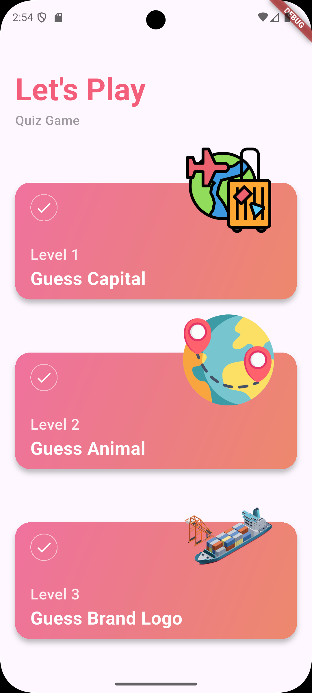
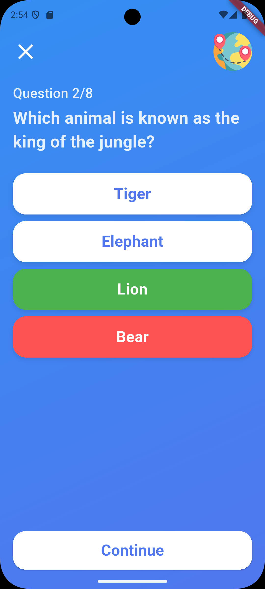
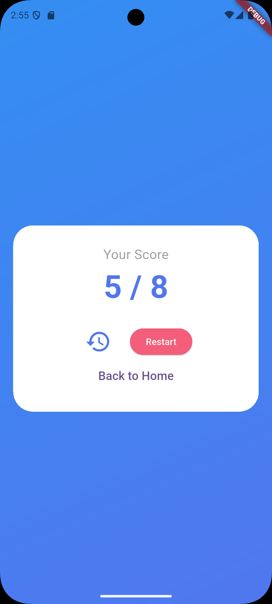
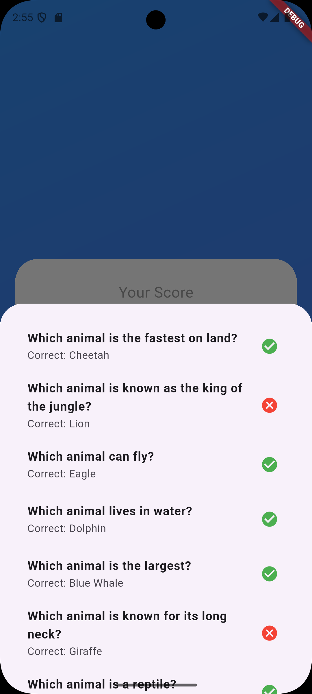

# Let's Play: Flutter Quiz App 🎈

A beautifully designed, interactive Quiz Application built with Flutter. This project was developed to demonstrate my skills in UI implementation, State Management, as a Flutter Trainee.

How to Run:
1. Clone the repository:
   ```bash git clone [https://github.com/YOUR_USERNAME/flutter-quiz-app.git](https://github.com/YOUR_USERNAME/flutter-quiz-app.git)
2. Install dependencies: flutter pub get
3. Run the build_runner (to generate JSON serialization models): flutter pub run build_runner build

## 📱 Screenshots

<p align="center">
  
  
  
  
</p>